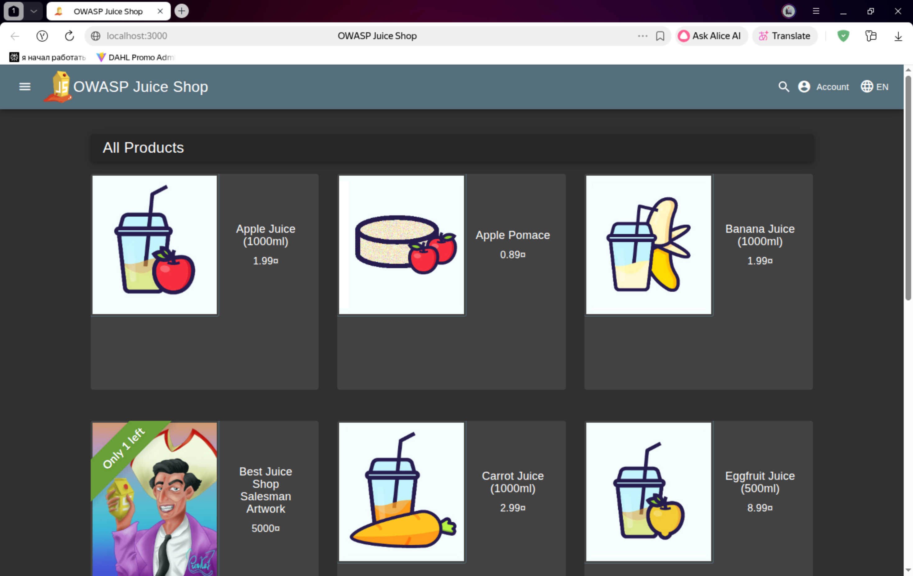

# Triage Report — OWASP Juice Shop

## Scope & Asset
- Asset: OWASP Juice Shop (local lab instance)
- Image: bkimminich/juice-shop:v19.0.0
- Release link/date: https://github.com/juice-shop/juice-shop/releases/tag/v19.0.0 - Sep 4, 2025
- Image digest (optional): sha256:2765a26de7647609099a338d5b7f61085d95903c8703bb70f03fcc4b12f0818d

## Environment
- Host OS: Ubuntu 24.04
- Docker: 29.1.5

## Deployment Details
- Run command used: `docker run -d --name juice-shop -p 127.0.0.1:3000:3000 bkimminich/juice-shop:v19.0.0`
- Access URL: http://127.0.0.1:3000
- Network exposure: 127.0.0.1 only [x] Yes  [ ] No  (explain if No)

## Health Check
- Page load: attach screenshot of home page (path or embed)

- API check: first 5–10 lines from `curl -s http://127.0.0.1:3000/rest/products | head`
{
  "status": "success",
  "data": [
    {
      "id": 1,
      "name": "Apple Juice (1000ml)",
      "description": "The all-time classic.",
      "price": 1.99,
      "deluxePrice": 0.99,
      "image": "apple_juice.jpg",

## Surface Snapshot (Triage)
- Login/Registration visible: [x] Yes  [ ] No — notes: I found /login
- Product listing/search present: [x] Yes  [ ] No — notes: I found /search
- Admin or account area discoverable: [x] Yes  [ ] No — notes: I found /profile
- Client-side errors in console: [x] Yes  [ ] No — notes: I found error "unauthorized" with wrong password
- Security headers (quick look — optional): `curl -I http://127.0.0.1:3000` → CSP/HSTS present? notes: CSP not present, HSTS not present. Present headers include X-Content-Type-Options: nosniff and X-Frame-Options: SAMEORIGIN.

## Risks Observed (Top 3)
1) **Insecure Direct Object References (IDOR)** — API endpoints may allow unauthorized access to sensitive data.
2) **Lack of Security Headers** — The absence of essential security headers increases the risk of client-side vulnerabilities, including Cross-Site Scripting (XSS).
3) **Overly Permissive CORS Policy** — A CORS policy that allows all origins (Access-Control-Allow-Origin: *) can lead to data theft by enabling malicious sites to make unauthorized API calls and access sensitive information, such as credentials stored in browser cookies.

---

# GitHub Community
- Stars indicate the popularity and quality of a repository, helping others discover valuable resources and projects.
- Following developers fosters collaboration and keeps you updated on their contributions, insights, and projects, enhancing your learning and networking opportunities.

## PR Template & Workflow
- PR template created at `.github/pull_request_template.md`
- Template includes sections: Goal, Changes, Testing, Artifacts & Screenshots
- Checklist covers: clear title, docs updated, no secrets in code

## GitHub Community Engagement
- Starred the course repository
- Starred the simple-container-com/api project
- Followed professors and TAs on GitHub
- Followed classmates for collaboration

