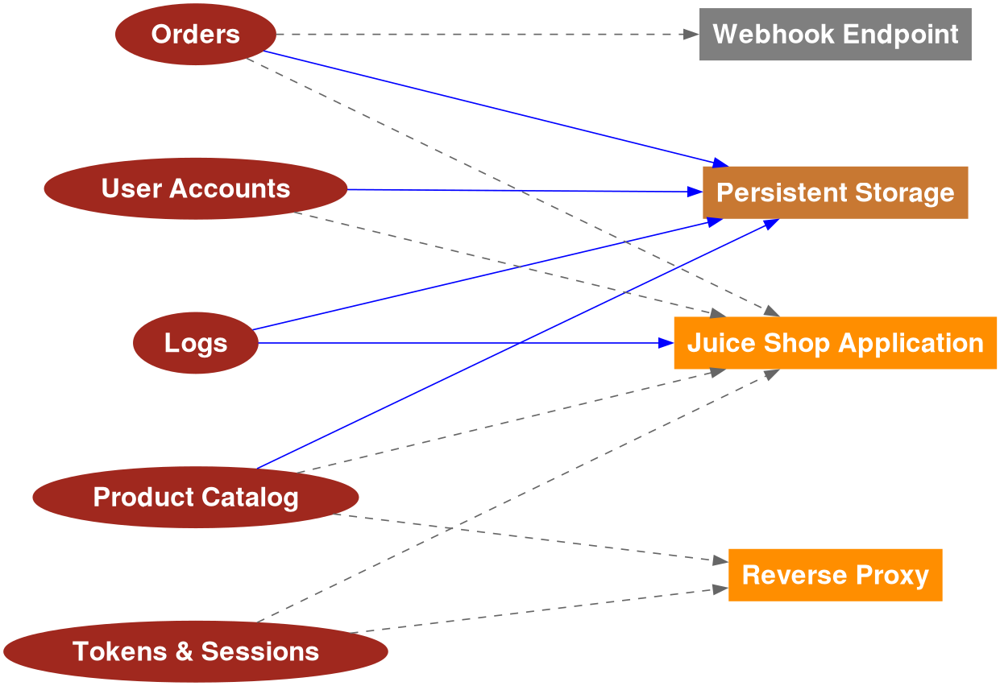
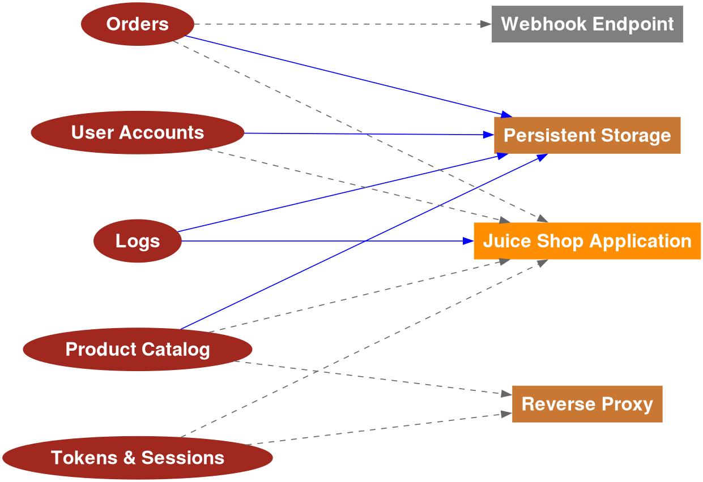

# Lab 2 — Threagile Threat Modeling (Juice Shop)

## Task 1 — Baseline Model Results

### Generated Outputs
- PDF report: lab2/baseline/report.pdf
- Data-flow diagram: lab2/baseline/data-flow-diagram.png
- Data-asset diagram: lab2/baseline/data-asset-diagram.png
- Risk export: lab2/baseline/risks.json

### Top 5 Risks (Baseline)
| Rank | Risk (Title) | Severity | Category | Asset | Likelihood | Impact | Composite |
|---:|---|---|---|---|---|---|---:|
| 1 | Unencrypted Communication named Direct to App (no proxy) between User Browser and Juice Shop Application transferring authentication data (like credentials, token, session-id, etc.) | elevated | unencrypted-communication | user-browser | likely | high | 433 |
| 2 | Cross-Site Scripting (XSS) risk at Juice Shop Application | elevated | cross-site-scripting | juice-shop | likely | medium | 432 |
| 3 | Unencrypted Communication named To App between Reverse Proxy and Juice Shop Application | elevated | unencrypted-communication | reverse-proxy | likely | medium | 432 |
| 4 | Missing Authentication covering communication link To App from Reverse Proxy to Juice Shop Application | elevated | missing-authentication | juice-shop | likely | medium | 432 |
| 5 | Cross-Site Request Forgery (CSRF) risk at Juice Shop Application via Direct to App (no proxy) from User Browser | medium | cross-site-request-forgery | juice-shop | very-likely | low | 241 |

### Risk Ranking Methodology
- Severity weights: critical (5) > elevated (4) > high (3) > medium (2) > low (1)
- Likelihood weights: very-likely (4) > likely (3) > possible (2) > unlikely (1)
- Impact weights: high (3) > medium (2) > low (1)
- Composite score formula: Severity*100 + Likelihood*10 + Impact

### Observations (Baseline)
- The highest-ranked risks are tied to unencrypted communications and client-side attacks (XSS/CSRF), which are consistent with direct HTTP access and a deliberately vulnerable app.
- Missing authentication on internal proxy-to-app communications remains a notable configuration risk.

### Diagrams (Baseline)
- 
- 

---

## Task 2 — Secure Variant & Risk Comparison

### Secure Model Changes
- User Browser → Direct to App: protocol set to https
- Reverse Proxy → To App: protocol set to https
- Persistent Storage: encryption set to transparent

### Risk Category Delta (Baseline vs Secure)
| Category | Baseline | Secure | Δ |
|---|---:|---:|---:|
| container-baseimage-backdooring | 1 | 1 | 0 |
| cross-site-request-forgery | 2 | 2 | 0 |
| cross-site-scripting | 1 | 1 | 0 |
| missing-authentication | 1 | 1 | 0 |
| missing-authentication-second-factor | 2 | 2 | 0 |
| missing-build-infrastructure | 1 | 1 | 0 |
| missing-hardening | 2 | 2 | 0 |
| missing-identity-store | 1 | 1 | 0 |
| missing-vault | 1 | 1 | 0 |
| missing-waf | 1 | 1 | 0 |
| server-side-request-forgery | 2 | 2 | 0 |
| unencrypted-asset | 2 | 1 | -1 |
| unencrypted-communication | 2 | 0 | -2 |
| unnecessary-data-transfer | 2 | 2 | 0 |
| unnecessary-technical-asset | 2 | 2 | 0 |

### Delta Run Explanation
- Enabling HTTPS on the direct browser link and the reverse-proxy-to-app link removed unencrypted-communication risks (Δ -2).
- Transparent encryption on persistent storage reduced unencrypted-asset risks (Δ -1).
- Other categories remain unchanged because the model did not add additional controls (e.g., WAF, MFA, hardening), so related risks persist.

### Diagrams (Secure)
- 
- 
